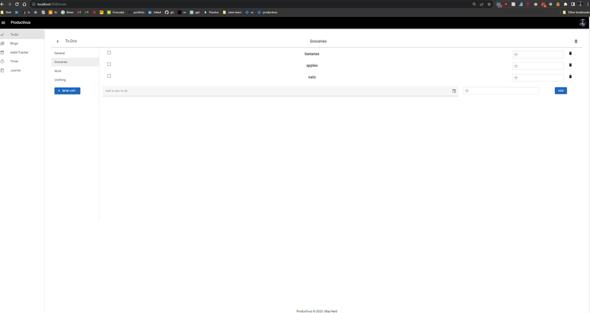

# Productivus

Productivus is your all-in-one solution for boosting productivity and achieving success in your daily life. This comprehensive tool combines the functionality of a journal, habit tracker, to-do list, calendar, digital wellbeing assistant, and much more.

## Tech Stack

### Frontend

- **Vue.js:** A progressive JavaScript framework for building user interfaces.
- **Vuetify:** A Material Design component framework for Vue.js.
- **Vite:** A fast, modern build tool for frontend development.
- **FirebaseAuthUI:** A user interface library for handling authentication with Firebase.
- **Cypress:** An end-to-end testing framework.

### Backend

- **Node.js:** A JavaScript runtime for server-side development.
- **Express:** A minimal and flexible Node.js web application framework.
- **SQL Server (on AWS RDS):** A relational database service on AWS.
- **Jest & Supertest:** Testing frameworks for integration tests.

### Code Quality

- Standard code style practices are enforced using ESLint.

### Dockerization

- Both the frontend and backend are containerized using Docker.

## Getting Started

For detailed instructions on how to run the frontend and backend, please refer to their respective README files:

- [Frontend README](Productivus-Frontend/README.md)
- [Backend README](Productivus-Backend/README.md)

## Contributing

We welcome contributions from the community! If you'd like to contribute to Productivus, please follow these guidelines:

1. Fork the repository.
2. Create a new branch for your feature or bug fix: `git checkout -b feature-name`.
3. Make your changes and commit them: `git commit -m 'Add some feature'`.
4. Push to the branch: `git push origin feature-name`.
5. Open a pull request with a clear title and description.

## License

This project is licensed under the [MIT License](LICENSE). Feel free to use, modify, and distribute it according to the terms of the license.

## Contact

If you have any questions or feedback, please don't hesitate to reach out at [rushan52@gmail.com](mailto:rushan52@gmail.com).

Thank you for using Productivus to supercharge your productivity!
